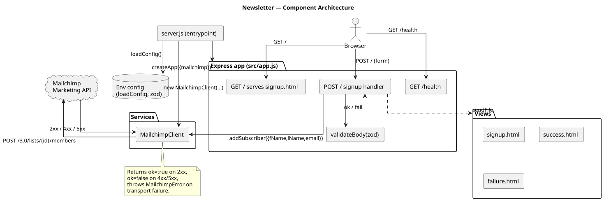
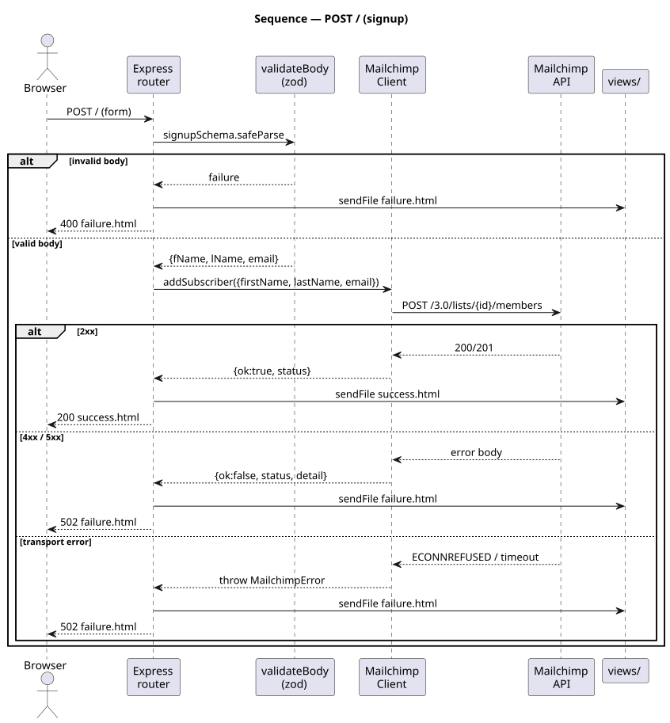
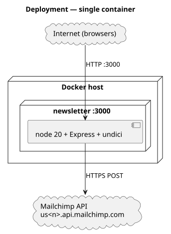

# Newsletter Signup

A small Express service that accepts a name + email and subscribes the user to
a Mailchimp audience.

[](https://github.com/tzone85/newsletter/actions/workflows/ci.yml)


Originally a single-file `app.js` with hardcoded credentials and the
deprecated `request` library. Rewritten with ESM modules, zod-validated env
config, the modern `undici` HTTP client, validation middleware, and a layered
structure that lets the Mailchimp client be mocked cleanly in tests.

## Highlights

- **No secrets in code** — Mailchimp API key, list ID, and data-centre prefix all come from env.
- **Validated requests** — zod schema rejects malformed/missing fields before any outbound call.
- **Three failure modes distinguished** — validation (400), Mailchimp business error (502), transport error (502).
- **Composition root** — `createApp({ mailchimp })` lets tests inject fakes; production wires the real `MailchimpClient`.
- **88% line coverage** across unit (`vitest` + `undici` `MockAgent`) and integration (`supertest` + fake client).
- **Docker** — multi-stage build, non-root user, healthcheck.
- **CI** — lint, tests, Docker build, and `npm audit` on every PR.

## Architecture

### Component view



### Signup flow sequence



### Deployment



Diagrams are PlantUML under `docs/architecture/*.puml`; rendered SVGs are
checked in. Regenerate with `./scripts/render_diagrams.sh` (`brew install plantuml`).

## Quick start

```bash
cp .env.example .env       # edit with real Mailchimp credentials
npm install
npm run dev                # node --watch reloads on save
# open http://localhost:3000
```

Or via Docker:

```bash
MAILCHIMP_API_KEY=xxx-us21 MAILCHIMP_LIST_ID=yyy docker compose up --build
```

## API surface

| Method | Path        | What                                                                       |
|--------|-------------|----------------------------------------------------------------------------|
| GET    | `/`         | Serves `views/signup.html`                                                 |
| POST   | `/`         | Form-encoded `{fName, lName, email}` → success or failure HTML             |
| POST   | `/failure`  | Redirects to `/` (for "try again" button)                                  |
| GET    | `/health`   | `{"status": "ok"}` for healthchecks/orchestrators                          |

### Status codes

| Code | When                                                                            |
|------|---------------------------------------------------------------------------------|
| 200  | Mailchimp accepted the subscription                                             |
| 400  | Validation failed (empty name, malformed email, etc.) — renders `failure.html`  |
| 502  | Mailchimp returned 4xx/5xx, or the request to Mailchimp failed at transport     |
| 500  | Unhandled error — JSON `{ "error": "internal server error" }`                   |

## Configuration

All settings come from env (or `.env` via `dotenv`):

| Variable                  | Required | Default | Purpose                                                                                       |
|---------------------------|----------|---------|-----------------------------------------------------------------------------------------------|
| `MAILCHIMP_API_KEY`       | yes      | —       | Mailchimp Marketing API key (`xxxxxxx-us21`)                                                  |
| `MAILCHIMP_LIST_ID`       | yes      | —       | Audience / list ID                                                                            |
| `MAILCHIMP_SERVER_PREFIX` | no       | derived | Data-centre prefix (e.g. `us21`). Auto-derived from the `-<dc>` suffix of `MAILCHIMP_API_KEY` |
| `PORT`                    | no       | `3000`  | HTTP port                                                                                     |
| `LOG_LEVEL`               | no       | `info`  | `debug` / `info` / `warn` / `error`                                                           |

## Project layout

```
src/
├── config.js              # zod-validated env loading
├── server.js              # entrypoint (composition root)
├── app.js                 # Express factory — used by tests too
├── middleware/
│   └── validate.js        # zod request-body middleware
├── routes/
│   └── signup.js          # GET / + POST /
└── services/
    └── mailchimp.js       # undici-based Mailchimp API client
views/                     # signup.html, success.html, failure.html
public/                    # static assets
tests/
├── unit/                  # config + Mailchimp client (MockAgent)
└── integration/           # routes via supertest with fake Mailchimp
docs/architecture/         # PlantUML sources + rendered SVGs
```

## Testing

```bash
npm test            # vitest + coverage
npm run test:watch  # vitest watch mode
npm run lint        # eslint
```

| Suite                  | Count | Notes                                                            |
|------------------------|-------|------------------------------------------------------------------|
| `tests/unit/`          | 11    | `config`, `MailchimpClient` (via undici `MockAgent`)             |
| `tests/integration/`   | 9     | Routes via `supertest` against `createApp({ mailchimp: fake })`  |
| **Total**              | **20** | 88% line / 76% branch coverage                                 |

## Security notes

- The previous version of this file (`app.js` removed in this PR) committed a Mailchimp API key in plaintext on 2020-05-17. **Rotate that key in your Mailchimp account** — git history retains the original commit even after the file is removed.
- Production secrets must come from env / a secret manager — never `.env` checked in (`.env` is in `.gitignore`, only `.env.example` is committed).

## License

MIT — see [LICENSE](LICENSE).
